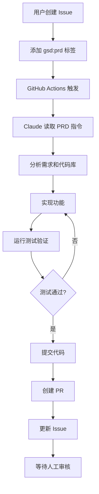
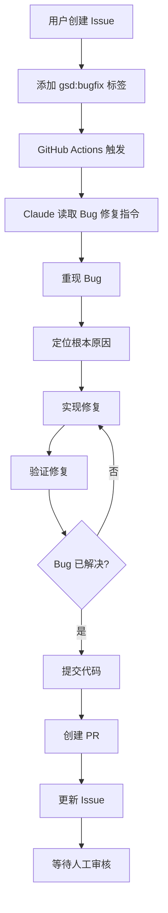

# Claude Auto-Dev Agent 使用指南

## 概述

本项目集成了 Claude AI Agent，可以自动完成功能开发和 Bug 修复。只需在 GitHub Issue 上添加特定标签，Claude 就会自动：
- 创建开发分支
- 实现功能或修复 Bug
- 运行测试验证
- 创建 Pull Request
- 更新 Issue 状态

## 🚀 如何使用

### 功能开发（PRD）

1. **创建 Issue**：在 GitHub 上创建一个新 Issue
2. **编写 PRD**：在 Issue 正文中详细描述功能需求
3. **添加标签**：为 Issue 添加 `gsd:prd` 标签
4. **等待完成**：Claude 会自动完成开发并创建 PR

**Issue 模板示例：**
```markdown
## 功能需求
实现用户标签导出功能

## 需求描述
- 支持导出选中的标签为 JSON 格式
- 导出文件命名规则：tags_export_YYYYMMDD.json
- 包含标签的所有字段：id, name, category, translations

## 验收标准
- [ ] 可以选择多个标签进行导出
- [ ] 导出的 JSON 格式正确
- [ ] 文件自动下载到本地
```

### Bug 修复

1. **创建 Issue**：在 GitHub 上创建一个新 Issue
2. **描述 Bug**：包含重现步骤、期望行为、实际行为
3. **添加标签**：为 Issue 添加 `gsd:bugfix` 标签
4. **等待完成**：Claude 会自动调查并修复 Bug

**Issue 模板示例：**
```markdown
## Bug 描述
删除标签后页面没有自动刷新

## 重现步骤
1. 进入标签管理页面
2. 点击某个标签的删除按钮
3. 确认删除操作
4. 观察页面状态

## 期望行为
删除成功后，标签应该从列表中消失

## 实际行为
标签仍然显示在列表中，需要手动刷新页面才能消失

## 环境
- Browser: Chrome 120
- OS: macOS 14.0
```

## 🏷️ 支持的标签

| 标签 | 用途 | Claude 行为 | 指令文件 |
|------|------|-------------|----------|
| `gsd:prd` | 功能开发 | 完整开发流程：分析需求 → 实现 → 测试 → PR | `.claude/prd_instructions.md` |
| `gsd:bugfix` | Bug 修复 | 完整修复流程：重现 → 调查 → 修复 → 测试 → PR | `.claude/bugfix_instructions.md` |

## 📋 工作流程

### PRD 功能开发流程



### Bug 修复流程



## 🔧 配置说明

### 必需的 Secrets

在 GitHub Repository Settings → Secrets 中配置：

- `ANTHROPIC_API_KEY`: Claude API 密钥
- `GH_PAT_TOKEN`: GitHub Personal Access Token（需要 repo 和 pull_request 权限）

### Runner 要求

- **运行环境**: self-hosted (Mac)
- **必需工具**:
  - `claude` CLI (Claude Code)
  - `gh` CLI (GitHub CLI)
  - `git`
  - Python 3.8+

### 验证安装

```bash
# 检查 Claude CLI
which claude
claude --version

# 检查 GitHub CLI
which gh
gh --version

# 检查 Git
git --version

# 检查 Python
python3 --version
```

## 📝 最佳实践

### 编写好的 PRD Issue

✅ **好的 PRD**：
- 清晰的功能描述
- 明确的验收标准
- UI/UX 要求（如有）
- 技术限制或偏好

❌ **不好的 PRD**：
- "添加一个新功能"（太模糊）
- 缺少验收标准
- 没有说明期望的用户体验

### 编写好的 Bug Issue

✅ **好的 Bug Report**：
- 清晰的重现步骤
- 预期和实际行为对比
- 错误信息和截图
- 环境信息

❌ **不好的 Bug Report**：
- "网站坏了"（太模糊）
- 没有重现步骤
- 缺少环境信息

## 🔍 监控和调试

### 查看 Claude 执行日志

1. 进入 Actions 标签页
2. 选择对应的 workflow run
3. 查看 job 输出日志

### 常见问题

**Q: Claude 创建了 PR 但没有更新 Issue**
A: 检查 GH_PAT_TOKEN 权限是否包含 issue 写入权限

**Q: Workflow 没有触发**
A: 确保标签名称完全匹配 `gsd:prd` 或 `gsd:bugfix`（区分大小写）

**Q: Claude 说需求不清晰**
A: Claude 会在 Issue 中评论询问，补充信息后它会继续工作

**Q: 测试失败导致没有创建 PR**
A: 检查 workflow 日志，Claude 会说明测试失败的原因

## 📚 进阶配置

### 自定义 Claude 行为

编辑指令文件来调整 Claude 的行为：
- `.claude/prd_instructions.md` - PRD 开发流程
- `.claude/bugfix_instructions.md` - Bug 修复流程

### 添加新的标签类型

1. 在 `.github/workflows/claude_auto_dev.yml` 中添加新 job
2. 创建新的指令文件（如 `.claude/refactor_instructions.md`）
3. 配置触发条件

示例：
```yaml
refactoring:
  if: github.event.label.name == 'gsd:refactor'
  runs-on: self-hosted
  steps:
    - name: Checkout Repository
      uses: actions/checkout@v4
      with:
        fetch-depth: 1
    
    - name: Claude Refactoring
      env:
        ANTHROPIC_API_KEY: ${{ secrets.ANTHROPIC_API_KEY }}
        GH_TOKEN: ${{ secrets.GH_PAT_TOKEN }}
      run: |
        export PATH=$PATH:/opt/homebrew/bin:/usr/local/bin
        claude "@.claude/refactor_instructions.md Handle GitHub Issue #${{ github.event.issue.number }}" \
          --non-interactive
```

## 🤝 人工审核

Claude 完成工作后：

1. **审核 PR**：检查代码质量和逻辑正确性
2. **测试功能**：手动验证功能是否符合需求
3. **提供反馈**：在 PR 中评论改进建议
4. **合并或关闭**：决定是否接受 Claude 的实现

## 📊 效果追踪

建议追踪以下指标：
- Claude 成功率（创建的 PR 数 / 触发次数）
- PR 合并率（合并的 PR / 创建的 PR）
- 平均处理时间（从添加标签到 PR 创建）
- 人工修改频率（合并前需要修改的 PR 比例）

## 🛡️ 安全注意事项

- ⚠️ Claude 可以修改任何文件，请定期审核 PR
- ⚠️ 不要在公开 Issue 中包含敏感信息
- ⚠️ API Key 和 Token 必须保存在 Secrets 中
- ⚠️ 建议在测试分支上先验证功能

## 📖 相关文档

- [Claude CLI 文档](https://docs.anthropic.com/claude/docs)
- [GitHub Actions 文档](https://docs.github.com/actions)
- [GitHub CLI 文档](https://cli.github.com/manual/)

---

**Happy Coding with Claude! 🎉**
